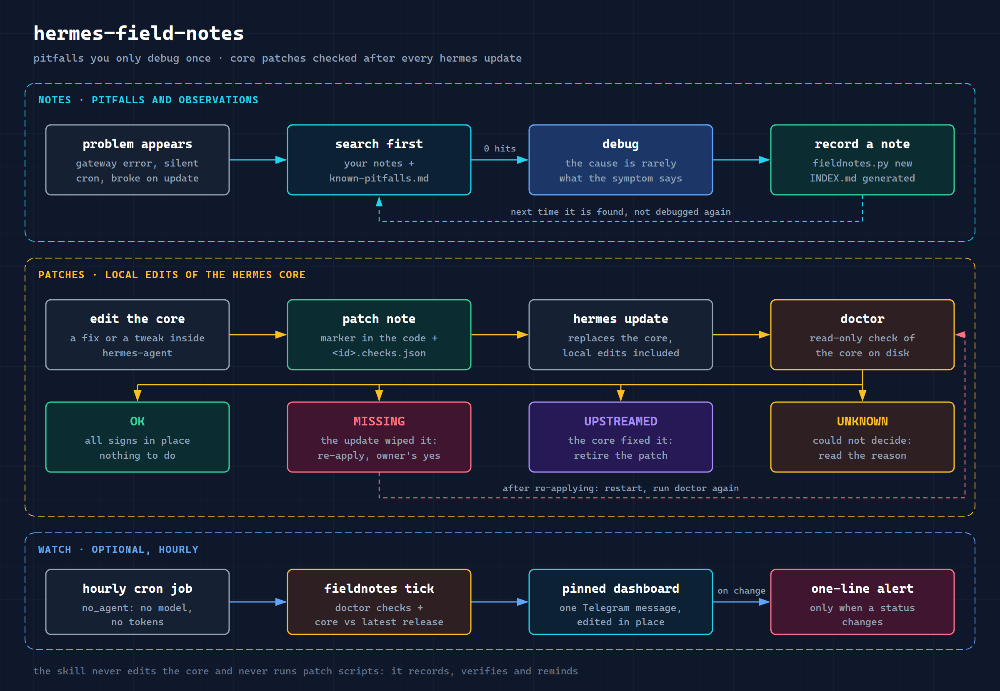
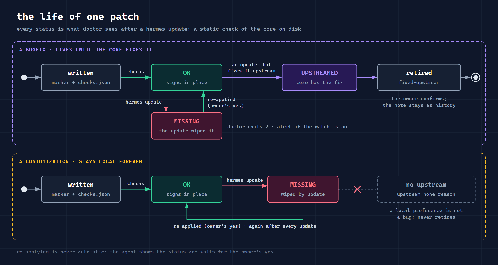

# hermes-field-notes


**Field notes for a Hermes Agent installation:** pitfalls with their root cause, local patches of
the Hermes core checked after every `hermes update`, and an optional pinned Telegram dashboard.

[Русская версия](README.ru.md)

Every long-running Hermes install accumulates two kinds of hard-won knowledge that quietly get lost:

- **pitfalls** — "the cron job was silent because the user service had no linger", "an unquoted
  colon in a skill description makes the plugin loader drop the skill without a word". They cost
  an hour the first time and the same hour again a month later, unless someone wrote them down;
- **local core patches** — small edits inside `hermes-agent` that `hermes update` wipes out. You
  find out when the bug is back.

This skill gives the agent one place for both, and makes the patch half checkable.

## What it does



- **Search before debugging.** `fieldnotes.py search <error text>` looks through your notes and a
  bundled list of verified Hermes pitfalls ([`known-pitfalls.md`](skills/hermes-field-notes/references/known-pitfalls.md)).
- **Record after debugging.** Notes are Markdown files with a small frontmatter; `INDEX.md` is
  generated, never edited by hand. `lint` catches broken fields, stale notes and things that look
  like secrets.
- **Every core edit is a patch note** with a declarative checks file: which signs must be in which
  core file, per core version, and which signs mean the core fixed it upstream.
- **After an update, `doctor`** tells you, read-only, which patches are `OK`, `MISSING`,
  `UPSTREAMED`, `N/A` or `UNKNOWN` (with the reason), which core files were changed outside the
  registry, and which notes were verified on a different core.
- **Pinned dashboard** (optional): one Telegram message, edited in place by the agent's own bot,
  plus a one-line alert only when something changes. Runs as a `no_agent` cron job — no model call,
  no tokens.
- **Upstream drafts.** `issue-draft <id>` turns a bugfix note into a masked issue draft. Posting is
  always the human's call.

- **Patch recipes.** [`patch-recipes.md`](skills/hermes-field-notes/references/patch-recipes.md): five core
  bugfixes and five customizations one production install carries, each with the place in the core, the
  edit, a ready `checks.json` and the upstream status — a starting point, not a script that patches for you.

The skill never edits the core and never runs patch scripts: it records, verifies and reminds.

## Install

As a regular skill (recommended — the agent finds it by its description):

```bash
hermes skills install itpartypattaya/hermes-field-notes/skills/hermes-field-notes
```

Or as a plugin (installed disabled; enable it, the skill is then namespaced):

```bash
hermes plugins install itpartypattaya/hermes-field-notes
hermes plugins enable hermes-field-notes
```

Then set up the store and config, and check the result:

```bash
python3 ~/.hermes/skills/hermes-field-notes/scripts/install.py
python3 ~/.hermes/skills/hermes-field-notes/scripts/install.py --check
```

Optional hourly watch and dashboard — edit `~/.hermes/field-notes.json` first
(`dashboard.enabled`, `chat_id`, `thread_id`, `language`, `timezone`), then:

```bash
~/.hermes/hermes-agent/venv/bin/python ~/.hermes/skills/hermes-field-notes/scripts/install_cron.py --dry-run
~/.hermes/hermes-agent/venv/bin/python ~/.hermes/skills/hermes-field-notes/scripts/install_cron.py
```

Requirements: Hermes Agent ≥ 0.21 (written against 0.21.5), Python 3.11+, standard library only.
Patch checks need the core as a directory; `drift` additionally needs it to be a git checkout.

## Using it

Ask the agent in plain words: "what do we know about this error?", "write this down", "did the
patches survive the update?", "show the dashboard". Or run the script yourself:

```bash
FN=~/.hermes/skills/hermes-field-notes/scripts/fieldnotes.py
python3 $FN search "no_agent" "silent"
python3 $FN new cron-linger --area cron --title "Cron worker does not start without linger"
python3 $FN new quota-auth --type patch --area gateway --title "429 shown as an auth error"
python3 $FN index && python3 $FN lint
python3 $FN doctor
python3 $FN dashboard --format md
```

`--read-only` on any command guarantees no writes and no network.

### Example: `doctor` after an update

```
🩺 Hermes 0.21.5 · 🩹 5 ✅ · 1 ❌ · 🪤 24

Core
0.21.5 · rc.33-v0.21.5 · 8d30c4e
Updated 30.09 12:45 (UTC) (6 d ago) · was 0.21.3 (4f1c2a9)
Core changes outside the registry: none ✅

Patches — 6
bugfixes 4 · customizations 2 · workarounds 0
✅ 5 signs in place · ❌ 1 missing · ❔ 0 unknown
⬆️ fixed upstream (all time): 4 · bugfixes without an issue: 2
Core files under patches: 7 · oldest patch: 91 d
  ❌ 429 shown as an auth error · missing · 91 d
  …

doctor: a patch is MISSING — re-apply it (with the owner's consent)
```

## How patches are checked



A patch note `notes/<id>.md` has a sibling `notes/<id>.checks.json`:

```json
{"schema_version": 1,
 "editions": [{"when": {"min_version": "0.21.3"},
               "targets": [{"file": "gateway/run.py",
                            "contains": ["MY_PATCH_MARKER", "new_line_of_code()"],
                            "not_contains": ["old_line_of_code()"]}],
               "upstream": [{"file": "gateway/run.py", "contains": ["def upstream_fix("]}]}]}
```

`OK` means every sign is present — a static check of the tree on disk, not proof the code works.
A marker that survived while the code under it changed shows up as `UNKNOWN (partial)`, not as a
false green. Details: [`note-format.md`](skills/hermes-field-notes/references/note-format.md),
[`patch-scripts.md`](skills/hermes-field-notes/references/patch-scripts.md).

## Privacy and safety

- Notes stay on your machine (`$HERMES_HOME/field-notes/` by default); nothing is uploaded.
- Network: the Telegram Bot API, only when the dashboard is enabled and only to the chat you set
  (the bot token is read from the environment or `$HERMES_HOME/.env` and never printed); and the
  public GitHub API, without credentials, a few requests every 12 hours to compare your core with
  the latest release (`upstream.check: false` turns it off).
- Writes: the notes store, `$HERMES_HOME/cache/field-notes-state.json`, the cron script copy in
  `$HERMES_HOME/scripts/`, and the cron job if you run `install_cron.py`. The core is only read.

## Contributing a pitfall

Found a Hermes pitfall that is not specific to your install? Open a PR adding it to
[`known-pitfalls.md`](skills/hermes-field-notes/references/known-pitfalls.md) in the same format:
affected setups, verbatim symptom, mechanism in the core, workaround, the version you verified it
on, and the upstream issue if there is one.

## Tests

```bash
python -m unittest discover -s tests
```

Standard library only, no network (Telegram is faked). Trigger prompts for the skill:
`tests/evals/evals.json`.

## Related

- [field-notes](https://github.com/itpartypattaya/field-notes) — the same idea for Claude Code and
  Codex CLI, without the Hermes-specific parts.
- [hermes-cron](https://github.com/itpartypattaya/hermes-cron) — operating Hermes cron jobs.
- [hermes-dreaming](https://github.com/itpartypattaya/hermes-dreaming) — nightly memory consolidation.

MIT © Anton Vaskov
